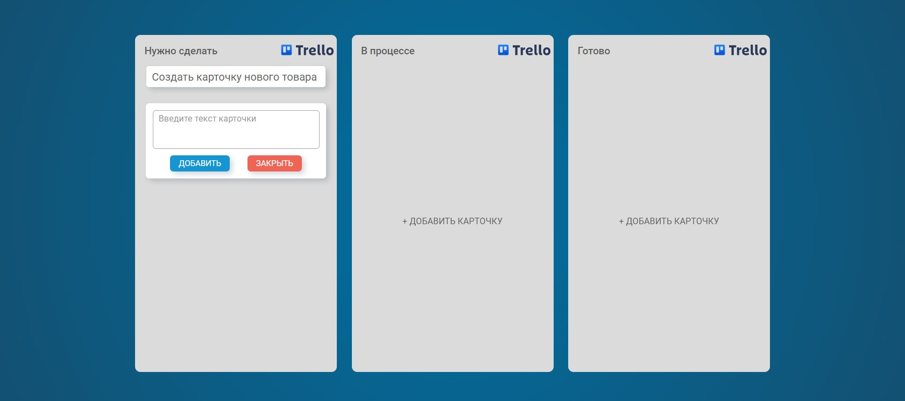
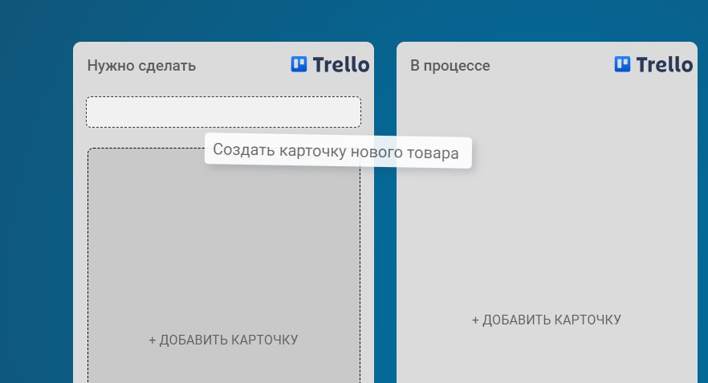

[GitHub Pages Trello](https://lekseff.github.io/Trello/)

# Trello

#### Описание

Доска состоящая из колонок, в каждой колонке может быть несколько карточек.

Доска позволяет:
1. Добавлять карточки с помощью кнопки 'Добавить карточку'. 

2. Удалять карточки - при наведении на карточку появляется иконка крестик, которая и удаляет карточку.

3. Перемещать карточки как внутри колонки, так и между колонками:

### Процесс перемещения

1. Внешний вид в момент переноса (карточка удаляется из своего начального положения):

2. Курсор по отношению к карточке остаётся там, где изначально схватили - не привязывается ни к левому краю, ни к центру, а там, где схватили карточку.

3. При наведении на другие позиции под карточку выделяется место по высоте равное размеру самой карточке, при это будет карточка ставится "до" или "после" элемента определяется исключительно позицией курсора.
   
Небольшие ограничения:
1. Кол-во колонок фиксировано и равно 3
2. Новые колонки добавлять нельзя, удалять имеющиеся тоже
3. Перемещать колонки тоже нельзя
